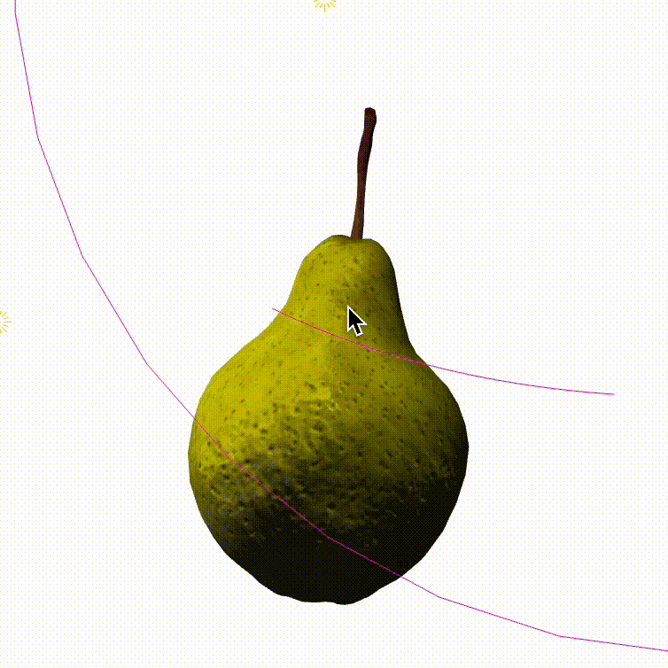
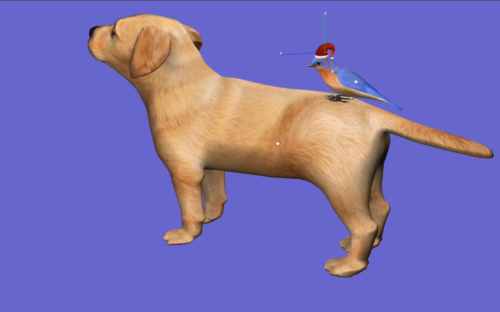
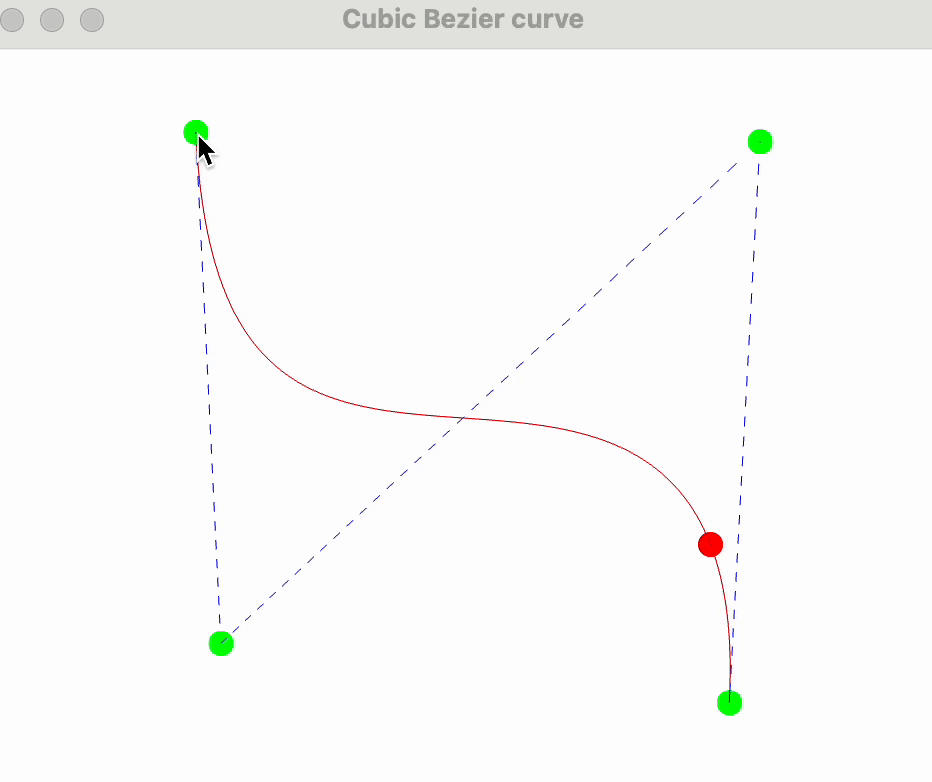

## **Computer Graphics course taught by Professor Jules Bloomenthal (MSCS, Seattle University)**

Main textbook - _"Computer Graphics:Implementation and Explanation"_ by J.Bloomenthal

**Technologies used:** OpenGl, GLSL, C++

### Assignments

(1) On graph paper sketch 2D letter, define each vertex coordinates, vertex indices, rgb colors for each vertex, display a letter and rotate it.

 

(2) Transform 2d to 3d letter, shade it, set up camera for rotation, movement, zoom.
 

 

(3) Texture-map 3d letter, improve lighting by using multiple lights

 

(4) Smooth-shade and textute-map a mesh (use free OBJ file from internet)

 

(5) Adding bump-mapping to the pear

 

(6) Implement hierarchical relationship of dog, bird, hat

 

(7) Draw cubic parametric 3D Bezier curve

 

(8) Create interpolation between shapes using Tesselattion shader

 

(9) Animate an airplane along a flight path with the propeller spins

 
